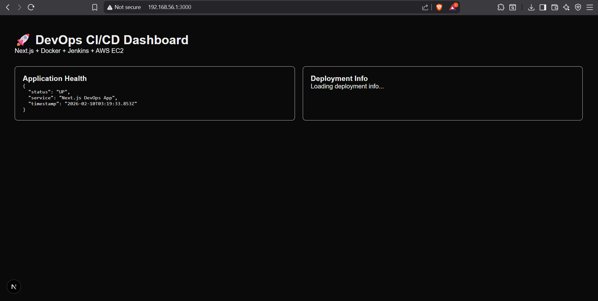
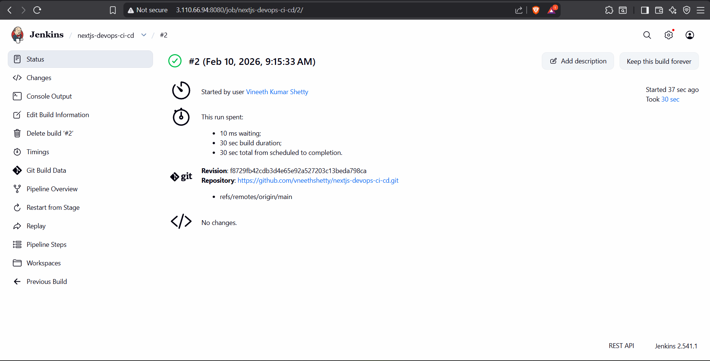
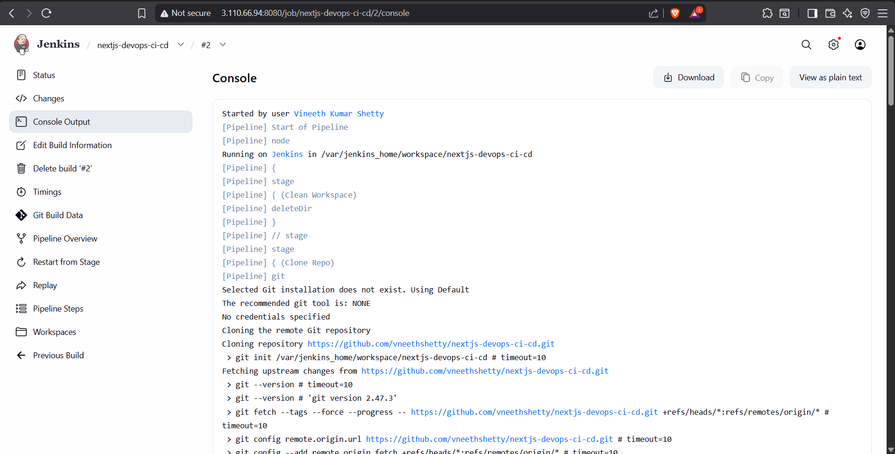
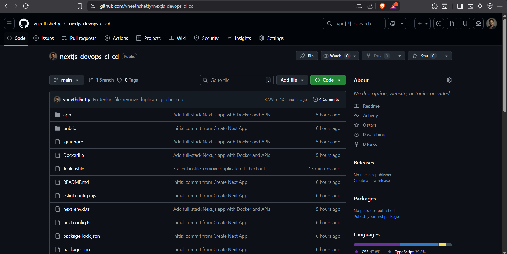

# 🚀 Next.js DevOps CI/CD Project

A full-stack Next.js application deployed using a complete DevOps CI/CD pipeline.

## 🔧 Tech Stack
- Frontend & Backend: Next.js (React, API Routes)
- CI/CD: Jenkins
- Containerization: Docker
- Cloud: AWS EC2
- Version Control: Git & GitHub

## 🏗️ Architecture


## ⚙️ CI/CD Pipeline Flow
1. Developer pushes code to GitHub
2. Jenkins pipeline triggers automatically
3. Jenkins builds Docker image
4. Old container is stopped
5. New container is deployed on AWS EC2

## 📸 Screenshots

### Live Application


### Jenkins Pipeline


### Jenkins Console Output


### GitHub Repository


## 🧠 Key Learnings
- Built end-to-end CI/CD pipeline using Jenkins
- Dockerized a full-stack Next.js application
- Deployed and managed application on AWS EC2
- Debugged real-world Jenkins, Docker, and Git issues

## ▶️ How to Run Locally
```bash
npm install
npm run dev


Save it.

---

## 📤 STEP 4: Push Screenshots & README to GitHub

In PowerShell:

```powershell
git add screenshots README.md
git commit -m "Add README and CI/CD screenshots"
git push
